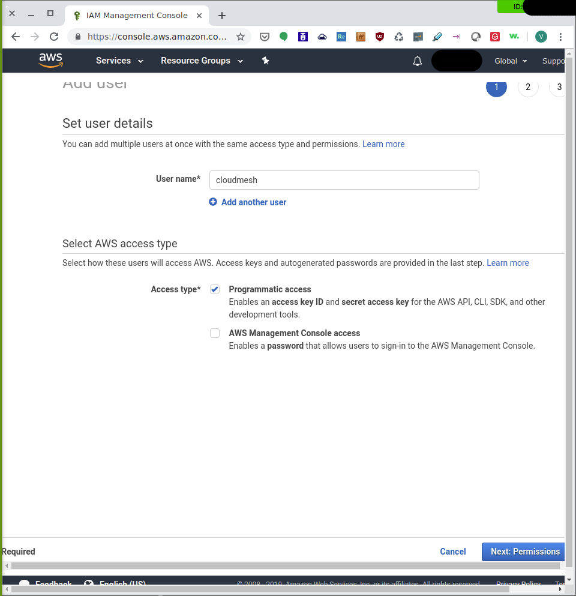
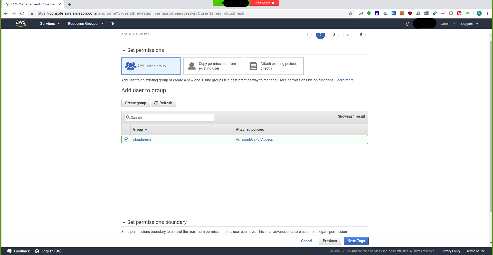
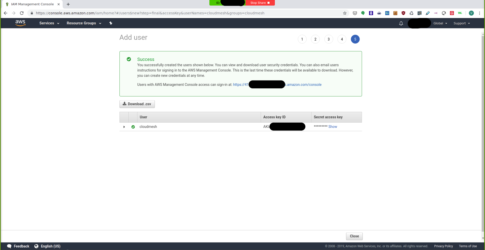
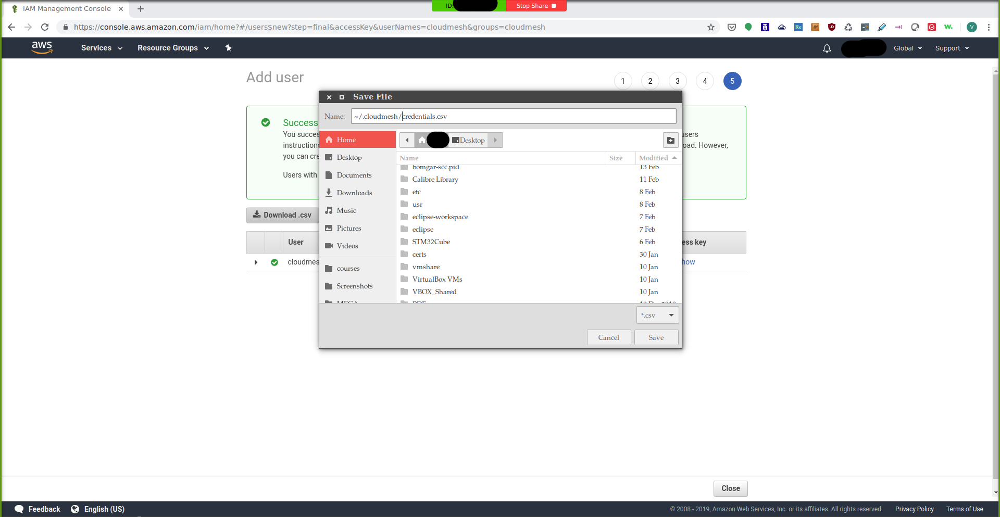
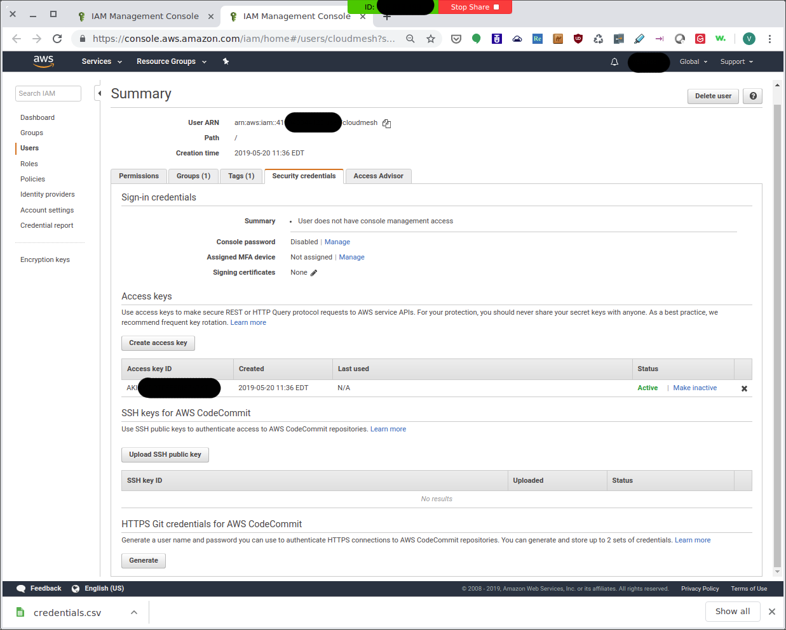
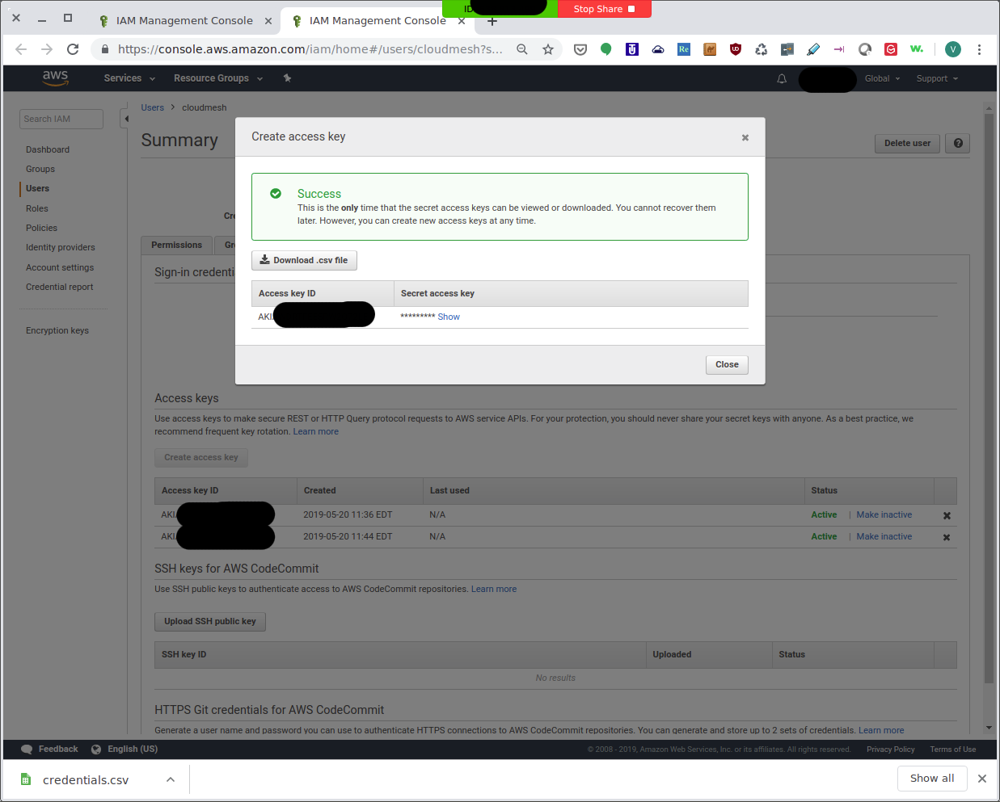
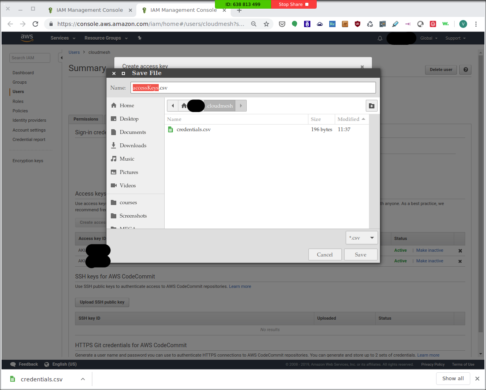

# AWS Account Creation

Amazon Web Services (AWS) provides a wide variaty of cloud-based
products including analytics, application integration, AR and VR, cost
management, blockchain, business applications, compute, customer
engagement, database, developer tools, end user computing, game tech,
IoT, machine learning, management and governance, media services,
migration and transfer, mobile, networking and content delivery,
robotics, satellite, security, identity and compliance, and storage.
Here at cloudmesh, we develop services through providers to support your
utilization of many of these products.

Here we are especially interested in using the following services:

-   **Amazon Elastic Compute Cloud (EC2)** Amazon EC2 is web service
    that enables users to perform elastic web-scable computing while
    having complete control over instances. It is integrated with most
    AWS services such as Amazon S3, RDS, and VPC.
-   **Amazon Simple Storage Service (S3)** Amazon S3 an object storage
    service that offers a wide range of storage classes.

We provide a step-by-step guide on how to create an AWS account through
the AWS webpage to utilize these services. For more information you can 
consult the 
[AWS FAQ](https://aws.amazon.com/premiumsupport/knowledge-center/create-and
-activate-aws-account/).

First, we go to the AWS website

-   <https://aws.amazon.com>

and click on `Create an AWS Account`.


This will direct you to the account creation page. Now we fill out your
information and click `Continue`.


Next, you will need to fill out your contact information. You can choose
`Professional` or `Personal` as your account type. Here in this
tutorial, we selected `Personal`. Read the *AWS Customer Agreement*, and
check the box if agreed. Click on `Create Account and Continue` to
continue.


Fill out your payment information and proceed. Dependent on your level
of security, you may want to explore using a prepaid credit card if you
do not want to use your regular credit card.

If you just started using AWS, you will have a free account for a while
as AWS will state:

> We will not charge you unless your usage exceeds the AWS Free Tier
> Limits. - Amazon AWS

Please review the terms of the free tier carefully.


Next your need to confirm your identity. You can choose either
`Text message (SMS)` or `Voice call` to receive your verification code.
Here we choose `Text message (SMS)`. Enter your phone number and the
security check code and click `Send SMS`.


Enter the 4-digit verification code you received from your phone, and
click on `Verify Code`.


If you entered the correct verification code, you will see this page.
Click on `Continue`.


You will need to choose your support plan. We chose Amazon's free tier
`Basic Plan`.


Congratulations! You have successfully created an AWS account. Now you
can click on `Sign In to the Console` to sign in.


Enter the email address you used for registration, and click on `Next`.


Enter the password you used for registration, and click on `Sign In`.


Now you've successfully signed in to the AWS Management Console.


You can click on `Services` to explore AWS services through their
webpage.


You can also start managing your account and instances through our
cloudmesh services. This is especially of interest if you use cloudmesh
to manage your storage and computational needs while laso being able to
leverage other clouds.

- [ ] To do verify  this works and you have created a user.

## Access Key


Now that you have an account it is necessarry that you can authenticate to your
cloud account from a program or a command line. The isntructions for this can
 be found at

* <https://docs.aws.amazon.com/cli/latest/userguide/cli-chap-configure.html>

However, it is far easier to use the convenient cloudmesh tools by just using
the cloudmesh open command.

In case you have not yet added a user, you can visit the user creation page
with

```
$ cms open account aws
```


### Create and Download Access Key

After logging into your account, you will then see the following console: 


Click on `Add user` and begin the process for creating a new user. Type the 
name `cloudmesh` in the `User name` and make sure you check the `programmatic
 access`:



After clicking on the `Next: Permissions`, you then have to add the user to a
 group. If you do not have any group created, click on `Create group` button 
 and you will be redirected to the corresponding page. You can call the group
  `cloudmesh` and then check the select the `AmazonEC2FullAccess` for the 
  permission: 


After creating the group, select it so that the new user will be assigned to 
that group: 



In the next page you can create the tags for the new user. You can just 
create a `cloudmesh` key for the user as a tag: 


The next page is the review page where you can review the information you 
entered:


After clicking on `Create user` the user will be finally created and you will
 be redirected to the following success page: 
 


You can view the secret access key by clicking on the `show` button: 


Next, download the `.csv` file by clicking on the `Download .csv` button and 
save it as `~/.cloudmesh/credentials.csv`:


 
Then you can click on the `close` button and go back to the IAM Management 
Console which now provide you a summary of the newly created user called 
`cloudmesh` and looks  like this: 



By clicking on the `Create access key`, you can create another access key: 



As is mentioned in the screenshot, this is the only time you can view or 
download the secret access key. So go ahead and click on the `Download .csv 
file` and save it as `~/.cloudmesh/accessKey.csv`:



 
 
### Using the Access Key


To obtain the keys for an already existing account or the one that you just 
created you can use the command
 
 ```bash
$cms open account aws NAME
 ```
 
This command will open a browser window to the credential page of AWS. PLease
replace the NAME with your username that you created when you added your 
user to the IAM.

IN case you do not yet have a credentials choose the Security credentials tab 
and then choose Create access key. To see the new access key, choose Show. 
Your credentials will look something like this:

   Access key ID: AAABBCCHHH7EXAMPLE
   Secret access key: wJalrXUtnFhsjlashlkjh/bPxRfiCYEXAMPLEKEY

To download the key pair, choose Download .csv file. Store the keys in a 
secure location and do not by default store them in the Downloads folder. 
We recommend that you store is in ~/.cloudmesh, but before doing so make sure
the permissions for ~/.cloudmesh are restricted,
 

## Compute Service

- [ ] TODO: Aws EC2 account. Describe here if there is anything to be done for
  accessing EC2

## Storage Service

- [ ] TODO: Aws S3 account. Describe here if there is anything to be done for
  accessing S3

## References

Additional information about the services can be found at:

-   Open Distro for Elastic Search, <https://aws.amazon.com/?nc2=h_lg>
-   Amazon EC2, <https://aws.amazon.com/ec2/?nc2=h_m1>
-   Amazon S3, <https://aws.amazon.com/s3/?c=23&pt=1>
