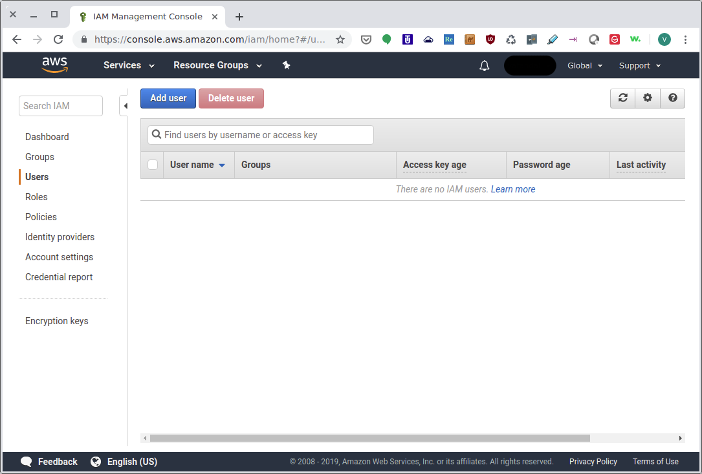
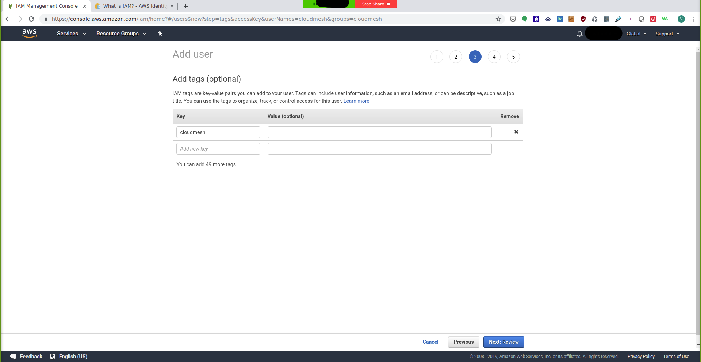
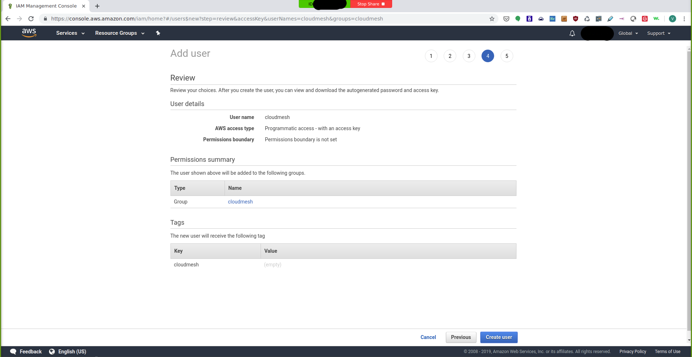
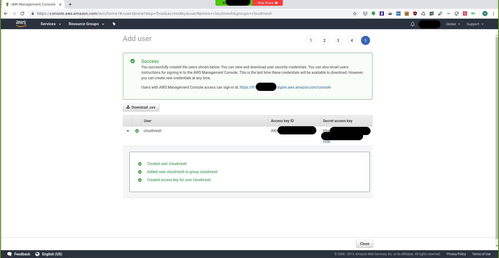
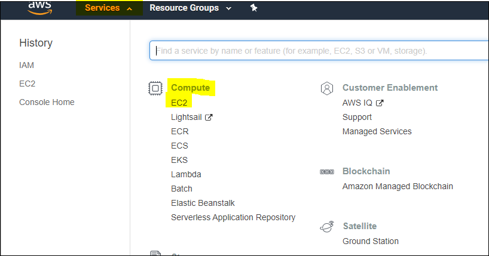
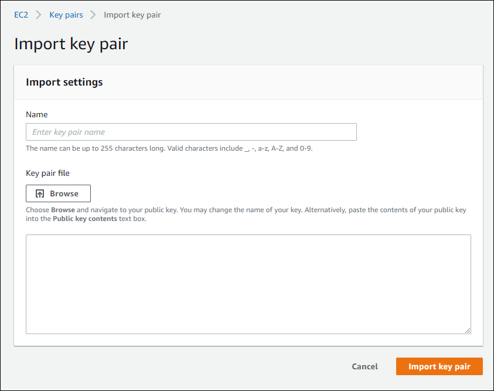
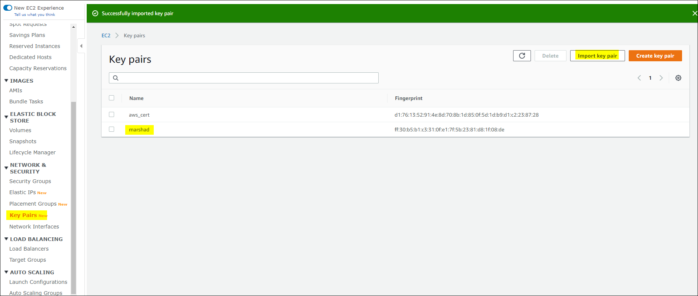
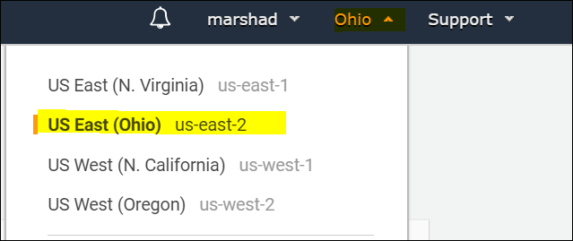

# AWS Account Creation

Amazon Web Services (AWS) provides a wide variety of cloud-based
products including analytics, application integration, AR and VR, cost
management, blockchain, business applications, compute, customer
engagement, database, developer tools, end user computing, game tech,
IoT, machine learning, management and governance, media services,
migration and transfer, mobile, networking and content delivery,
robotics, satellite, security, identity and compliance, and storage.
Here at cloudmesh, we develop services through providers to support your
utilization of many of these products.

Here we are especially interested in using the following services:

- **Amazon Elastic Compute Cloud (EC2)** Amazon EC2 is web service
    that enables users to perform elastic web-scalable computing while
    having complete control over instances. It is integrated with most
    AWS services such as Amazon S3, RDS, and VPC.
- **Amazon Simple Storage Service (S3)** Amazon S3 an object storage
    service that offers a wide range of storage classes.

We provide a step-by-step guide on how to create an AWS account through
the AWS Web page to utilize these services. For more information you can
consult the
[AWS FAQ](https://aws.amazon.com/premiumsupport/knowledge-center/create-and-activate-aws-account/).

First, we go to the AWS website

- <https://aws.amazon.com>

and click on `Create an AWS Account`.


This will direct you to the account creation page. Now we fill out your
information and click `Continue`.


Next, you will need to fill out your contact information. You can choose
`Professional` or `Personal` as your account type. Here in this
tutorial, we selected `Personal`. Read the *AWS Customer Agreement*, and
check the box if agreed. Click on `Create Account and Continue` to
continue.


Fill out your payment information and proceed. Dependent on your level
of security, you may want to explore using a prepaid credit card if you
do not want to use your regular credit card.

If you just started using AWS, you will have a free account for a while
as AWS will state:

> We will not charge you unless your usage exceeds the AWS Free Tier
> Limits. - Amazon AWS

Please review the terms of the free tier carefully.


Next your need to confirm your identity. You can choose either
`Text message (SMS)` or `Voice call` to receive your verification code.
Here we choose `Text message (SMS)`. Enter your phone number and the
security check code and click `Send SMS`.


Enter the 4-digit verification code you received from your phone, and
click on `Verify Code`.


If you entered the correct verification code, you will see this page.
Click on `Continue`.


You will need to choose your support plan. We chose Amazon's free tier
`Basic Plan`.


Congratulations! You have successfully created an AWS account. Now you
can click on `Sign In to the Console` to sign in.


Enter the email address you used for registration, and click on `Next`.


Enter the password you used for registration, and click on `Sign In`.


Now you've successfully signed in to the AWS Management Console.


You can click on `Services` to explore AWS services through their
Web page.


You can also start managing your account and instances through our
cloudmesh services. This is especially of interest if you use cloudmesh
to manage your storage and computational needs while also being able to
leverage other clouds.

- [ ] To do verify  this works and you have created a user.

## Access Key

Now that you have an account it is necessary that you can authenticate to your
cloud account from a program or a command line. The instructions for this can
 be found at

-<https://docs.aws.amazon.com/cli/latest/userguide/cli-chap-configure.html>

However, it is far easier to use the convenient cloudmesh tools by just using
the cloudmesh open command.

In case you have not yet added a user, you can visit the user creation page
with

```bash
cms open account aws
```

### Create and Download Access Key

After logging into your account, you will then see the following console:



Click on `Add user` and begin the process for creating a new user. Type the
name `cloudmesh` in the `User name` and make sure you check the `programmatic
 access`:


After clicking on the `Next: Permissions`, you then have to add the user to a
 group. If you do not have any group created, click on `Create group` button
 and you will be redirected to the corresponding page. You can call the group
  `cloudmesh` and then check the select the `AmazonEC2FullAccess` for the
  permission:


After creating the group, select it so that the new user will be assigned to
that group:


In the next page you can create the tags for the new user. You can just
create a `cloudmesh` key for the user as a tag:



The next page is the review page where you can review the information you
entered:



After clicking on `Create user` the user will be finally created and you will
 be redirected to the following success page:


You can view the secret access key by clicking on the `show` button:



Next, download the `.csv` file by clicking on the `Download .csv` button and
save it as `~/.cloudmesh/credentials.csv`:


Then you can click on the `close` button and go back to the IAM Management
Console which now provide you a summary of the newly created user called
`cloudmesh` and looks  like this:


By clicking on the `Create access key`, you can create another access key:


As is mentioned in the screen shot, this is the only time you can view or
download the secret access key. So go ahead and click on the `Download .csv
file` and save it as `~/.cloudmesh/accessKey.csv`:


### Using the Access Key

To obtain the keys for an already existing account or the one that you just
created you can use the command

 ```bash
$cms open account aws NAME
 ```

This command will open a browser window to the credential page of AWS. PLease
replace the NAME with your username that you created when you added your
user to the IAM.

IN case you do not yet have a credentials choose the Security credentials tab
and then choose Create access key. To see the new access key, choose Show.
Your credentials will look something like this:

   Access key ID: AAABBCCHHH7EXAMPLE
   Secret access key: wJalrXUtnFhsjlashlkjh/bPxRfiCYEXAMPLEKEY

To download the key pair, choose Download .csv file. Store the keys in a
secure location and do not by default store them in the Downloads folder.
We recommend that you store is in ~/.cloudmesh, but before doing so make sure
the permissions for ~/.cloudmesh are restricted,

## Compute Service

### Import Public key

Before we get started with AWS compute services, we need to be sure we import our public ssh key. We assume an ssh has already been set up under `~\.ssh\id_rsa.pub`. If this prerequisite has not yet been satisfied, please reference the installation section.

While logged into AWS's console, navigate to the EC2 Management Console under `Services > Compute > EC2`:



Next, on the left-hand panel, navigate to `Network & Security > Key Pairs` and select `Import key pair`. Once you're at the Import Settings screen, browse to `~\.ssh` and select the `id_rsa.pub` file. Name the imported file after the same username configured you have configured in the cloudmesh.yaml file.





### Cloudmesh.yaml Configuration for AWS

Please reference the section on Configuration for more information on getting, setting, and editing values to the cloudmesh.yaml configuration file; along with referencing the compute cloud provider templates and default values.

Run the following code to set the AWS compute provider values specific to your configuration. Alternatively, you can manually set these values using a text editor to update the cloudmesh.yaml file under `~\.cloudmesh`.

```cmd
cms config set cloudmesh.cloud.aws.cm.active=true
cms config set cloudmesh.cloud.aws.credentials.region=AWSMGMTCONSOLEREGIONVALUE
cms config set cloudmesh.cloud.aws.credentials.EC2_SECURITY_GROUP=SECGROUPVALUE
cms config set cloudmesh.cloud.aws.credentials.EC2_ACCESS_ID=ACCESSIDVALUE
cms config set cloudmesh.cloud.aws.credentials.EC2_SECRET_KEY=SECRETKEYVALUE
```

**Notes**:

- Region can be found while logged into the AWS management console in the upper right-hand side.


- EC2_ACCESS_ID and EC2_SECRET_KEY values can be found either during the initial setup in AWS, or by referencing the Access Key downloaded as a csv and moved to the `~\.cloudmesh` directory.


- TODO: Confirm if EC2_PRIVATE_KEY_FILE_PATH and EC2_PRIVATE_KEY_FILE_NAME cloudmesh.yaml AWS compute variables are being utilized, as these are not referenced in `Provider.py`. If this is not needed, remove from cloudmesh.yaml. If this is needed, update the AWS account section with the following steps:
  - Create a new key pair and name the key pair `aws_cert`. Then download the key and move to the `~\.cloudmesh` directory.
      

Once the values have been set:


run the following to get started and test AWS compute services:

```cmd
cms set cloud=aws
cms init
cms key init
cms vm boot
```

This should have allowed you to initialize cms with the updated configurations and boot up a new vm in AWS based.


Check the status of the vm by executing the following:

```cmd
cms vm list --refresh
```


Now test stopping the vm. Note that you may need to give it a minute or two before you refresh the vm list to validate Status=stopped.

```cmd
cms vm stop VMINSTANCENAME
```


Now test terminating the vm. (Note the example provided if you are attempting run commands against multiple vm's.)

```cmd
cms vm delete VMINSTANCENAME
```


- [x] TODO: Aws EC2 account. Describe here if there is anything to be done for accessing EC2

## Storage Service

- [ ] TODO: Aws S3 account. Describe here if there is anything to be done for
  accessing S3

## References

Additional information about the services can be found at:

- Open Distribution for Elastic Search, <https://aws.amazon.com/?nc2=h_lg>
- Amazon EC2, <https://aws.amazon.com/ec2/?nc2=h_m1>
- Amazon S3, <https://aws.amazon.com/s3/?c=23&pt=1>
