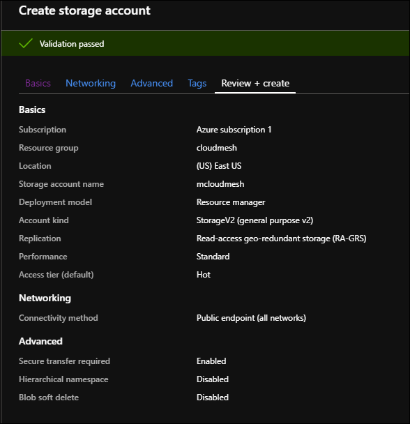
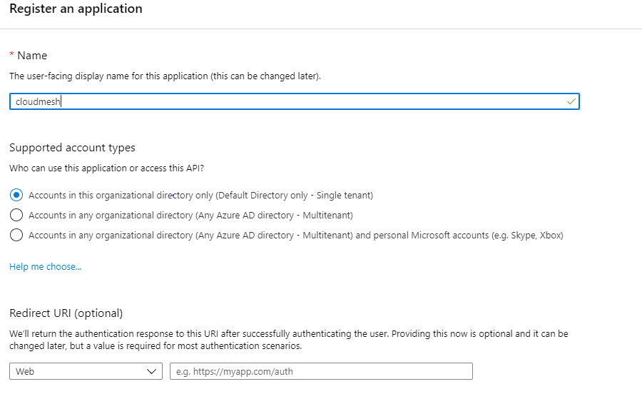
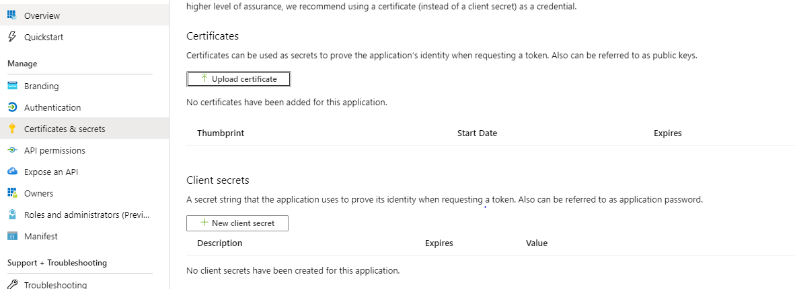

# Azure Account Creation

Microsoft Azure is a cloud computing service created by Microsoft for
building, testing, deploying, and managing applications and services
through Microsoft-managed data centers.

Azure has over 600 services, including compute, mobile service, storage
service, data management, messaging and so on. In this case, Azure
itself is a multi-functional platform. As for the compute service, which
is the core part for cloud computing, it provides virtual machines
allowing users to launch general-purpose Microsoft Windows and Linux
virtual machines, as well as preconfigured machine images for popular
software packages. The app services environment lets developers easily
publish and manage websites. Azure provides all its services to users
based on website, so users do not need to install any kind of software
in order to implement cloud computing or use other services;

## Azure Account

You can choose either using your outlook email address to create a free
trial account including $200 credit and free access to most popular
Azure products for 12 months, or using your educational email address to
create a student account including $100 credit.

If you want to create an azure account using your outlook email, you can
go to the next site after creating an outlook email address at:

- <https://azure.microsoft.com/en-us/>

Then you need to click the Start Free button as shown in the next
screen shot. After entering all required information, your account will
be set up. However, the account will only be available for 30 days.
After 30 days, you can continue using your free products after you
upgrade your account to a pay-as-you-go Azure subscription. If you
forget to do so you will not be able to access Azure, So pleas add it to
your calendar in order not to forget.


If you want to create an azure account using your educational email, you
can go to the next site if you already have an .edu email address:

- <https://azure.microsoft.com/en-us/free/students/>

Then you need to click the Activate now button showing in the next
figure. By entering all required information, your account will be set
up. If you use up all credits, you also need to upgrade your account to
a pay-as-you-go Azure subscription to continue using other services.


As pointed out, to continue to use azure services after 30 days, you
need to upgrade your account to a pay-as-you-go Azure subscription. In
this case, you need to provide your information related to your credit
card to complete the upgrade steps. Go to the next link and click on
`Purchase now`:

- <https://azure.microsoft.com/en-us/offers/ms-azr-0003p/>

Congratulations, you can now use Azure.

## Azure CLI

Now that we have an account we want to test if it works. The most
convenient way to test your access this from the command line is to
install the azure command line client. You can access azure services by
just typing command on your local shell. It can be installed on
Windows, macOS and Linux systems.

For detailed instructions for your system of interest we recommend you
visit the page

- <https://docs.microsoft.com/en-us/cli/azure/install-azure-cli?view=azure-cli-latest>

### Installing Azure CLI on Ubuntu OS

In the following steps we will only discuss how to install it on an
Ubuntu OS. First, make sure you have an up to date OS and that curl is
installed with:

```bash
$ sudo apt-get update
$ sudo apt-get install curl
```

The installation is conducted with the following command that you will
have to run as superuser:

```bash
$ curl -sL https://aka.ms/InstallAzureCLIDeb | sudo bash
```

When the installation is finished, you can test your az command by
trying to use it to connect to your azure account. Type the next command
in your bash:

```bash
$ az login
```

It opens your default browser and to conduct a sign-in to azure. If it
does not open, please go to <https://aka.ms/devicelogin> in your
browser. Once the page is loaded, you can sign in with your account
credentials in the browser.

### Installing Azure CLI on Windows 10

The following steps document an Azure CLI installation for Windows 10.

Start with opening up Windows PowerShell in Administrative Mode, then run the following:

```PowerShell
cd ~
~\ENV3\Scripts\Activate.ps1
Invoke-WebRequest -Uri https://aka.ms/installazurecliwindows -OutFile .\AzureCLI.msi; Start-Process msiexec.exe -Wait -ArgumentList '/I AzureCLI.msi /quiet'
```

Once installed, the next step is to test using the new `az` command. Let's start by running ``az login``, which will then prompt you to login via your default browser.
Note: you can now utilize Windows Command Prompt or PowerShell for interacting with the Azure CLI:

```cmd
az login
```

Sign in via the default browser using your Azure credentials.


Now you are ready to use the `az` command to interact with Azure.

## Azure Resource Group (for Storage)

To use any resource on Azure, you first need to create a resource group.
This is potentially a confusing step as information in the internet may
point you to outdated information. If you use other information from the
internet, make sure it is up to date and references the services subscription
account. After you logged into the Azure portal at:

- <https://portal.azure.com/>

You will be presented with a window such as


In the Azure window, click on `Create a resource` on the top left corner.


Now, select `Storage Account` from the options shown


Follow the steps carefully:

1. Select the subscription in which to create the storage account.
2. Under the `Resource group` field, select Create new.
    Enter a name for your new resource group.
3. Next, enter a name for your storage account.
4. Select a `location` for your storage account, or use the
    default location.
5. Select `create`

After the completion of above steps, Azure blob storage service will be
ready for use.



As a first step, a `Container` should be created in the Blob storage. A container organizes a set of blobs, similar to a directory in a file system. A default `Container` should be set in the
`cloudmesh.yaml` file, details of which are outlined [here](configuration/configuration.md)

## Azure API Credentials

### Azure_Subscription_ID

Navigate to subscriptions


Copy the Subscription ID to notepad


### Azure_Tenant_ID & Azure_Client_ID

Navigate to "Azure Active Directory" service and select "App Registrations".
Then select "New Registration"


You can input any name for the application



After creation, you will be navigated to the overview page of the application, on this page copy the client ID and tenant ID to notepad


### Azure_Secret_Key

In the same application page, navigate to Certificates & secrets and select "New client secret"



You can give any meaningful name to the new secret, use the default expiration for security purpose


 After creation, copy the new client secret to notepad
 

### Grant permission to application

After we have collected 4 credentials,
we need to add a role assignment to the application that we just created,
so it can access the resources

Navigate to the subscription overview page and select "Access control(IAM)"
then select "add", "Add role assignment"


You can give the application "Contributor" role,
the "contributor" role has enough access for compute resources.
Leave the second option as "Azure AD user, group, or service principal".
For third option, you need to input the application name that you just created,
it doesn't show up by default


### Add the credentials to cloudmesh.yaml

Now we need to open cloudmesh.yaml and add the 4 credentials
that we just collected to the "azure" section of cloudmesh.yaml


## Azure Resource Group (for Compute)

- [ ] TODO: Azure. Compute Resource Group. To be completed by students

## Azure Resource Group (for Storage and Compute)

- [ ] TODO: Azure. Storage and Compute Resource Group. To be
    completed by students.

## FAQ

Can the resource group be created with the az command? How is it done
for storage, how is it done for compute?

- [ ] todo: Azure. Compute and Storage FAQ: to be completed by
    student.

- [ ] TODO: there are several images in the folder `accounts/impgaes/azure`,
  but they are not used in the text]

## References

Additional references are included here

- <https://docs.microsoft.com/en-us/cli/azure/install-azure-cli-apt?view=azure-cli-latest>
- <https://docs.microsoft.com/en-us/cli/azure/?view=azure-cli-latest>
- <https://www.luminanetworks.com/docs-lsc-610/Topics/SDN_Controller_Software_Installation_Guide/Appendix/Installing_cURL_for_Ubuntu_1.html>
- <https://azure.microsoft.com/en-us/>
- <https://docs.microsoft.com/en-us/azure/storage/common/storage-introduction>
- <https://docs.microsoft.com/en-us/azure/storage/blobs/storage-blobs-overview>
