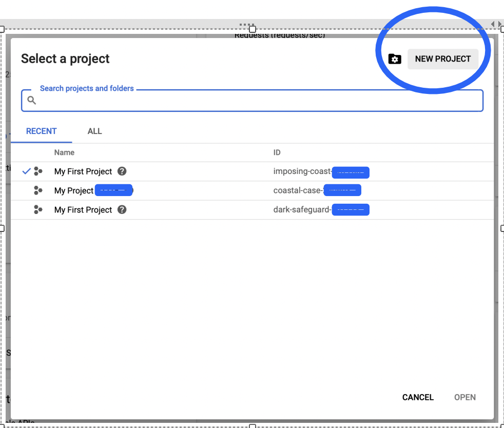

# Google Account

A new google account can be created using following information:

* [New Google Account Introduction](https://myaccount.google.com/intro)
* [Create your Google Account](https://accounts.google.com/signup/v2/webcreateaccount?service=cloudconsole&continue=https%3A%2F%2Fcloud.google.com%2Fstorage%2F%3Frefresh%3D1&gmb=exp&biz=false&flowName=GlifWebSignIn&flowEntry=SignUp&nogm=true)
 
Additional reference link for account creation support page:
  
* [Create a Google Account- Google Account Help](<https://support.google.com/accounts/answer/27441>)

## Instaltion of Cloudmesh Google Providers

To install the cloudmesh google providers you can simply use (not yet supported):

```bash
$ pip install cloudmesh-google
```

For developers the best way to install it is to use `cloudmesh-installer`. 

```bash
$ mkdir cm
$ cd cm
$ pip install cloudmesh-installer
$ cloudmesh-installer git clone google
$ cloudmesh-installer git install google
```

Next you have to cerate a google account and integarte it into a configuration
file called `~/.cloudmesh/cloudmesh.yaml`

## Google Account for using Cloudmesh Storage Service

For google cloud storage cloudmesh services(cms) provides command line
interface which is part of part of cloudmesh-google storage application.
Various available operations using cms are put(file upload), get(file downlod),
list, delete `object/blob`, create directory. First, we need to create an
account as follows:

### Create a Google Cloud Account 

Use the following link provided by google to create a free google account.
This account can provide you $300 in credits to use google cloud.

* [Get Started for Free](https://console.cloud.google.com/freetrial?_ga=2.36435558.-733144975.1575249772&_gac=1.216762084.1575249889.CjwKCAiA5o3vBRBUEiwA9PVzavyytvYEKObpJV-GtriRXXj9JCtqPkm3TEpyZ6pDgOHWgDXuqZ7tFBoCjacQAvD_BwE)

After you click this option, you can choose you existing google account or
create a new account using previously provided information. Students also have
option to use follwing option:
  
* [Google Cloud Platform | Google for Education](https://edu.google.com/products/google-cloud-platform/?utm_source=google&utm_medium=cpc&utm_campaign=na-US-all-en-dr-bkws-all-all-trial-b-dr-1007179&utm_content=text-ad-none-any-DEV_c-CRE_182323152622-ADGP_Hybrid%20%7C%20AW%20SEM%20%7C%20SKWS%20%7C%20US%20%7C%20en%20%7C%20Multi%20~%20Student-KWID_43700018304461092-kwd-285517564251&utm_term=KW_%2Bstudent%20%2Bcloud-ST_%2BStudent%20%2BCloud&gclid=EAIaIQobChMI07zC9eeV5gIVhMBkCh2yMwA2EAAYASAAEgKmHfD_BwE&modal_active=none)

Limitations exists for the education account as you may need additional
approvals and professor need to request for choosing this option. For help on
questions with the account creatione please visit
  
* [Create a Google Account- Google Account Help](<https://support.google.com/accounts/answer/27441>)


### Create a Project

Next, you will need to create a project in your Google cloud account. We recommend that you simply use the name 
`cloudmesh`. You can create such a project at 
  
* [Google Storage - Online Data Storage | Cloud Storage | Google Cloud](<https://console.cloud.google.com/>)
  
The three screenshots show the workflow on how to create a project:
   



   
### Create a Service Account ???????????

Now you need to also create a service account. Although, there are many other
methods for authentication, we use a service account as it is easy to set up
and configure. Additional methods are listed at:
  
* [Authentication Overview | Authentication | Google Cloud](https://cloud.google.com/docs/authentication/)
  
  https://console.cloud.google.com/apis/credentials/serviceaccountkey?pli=1&project=cloudmesh-class&folder&organizationId
  
To create it you need to select the newly created project and go to 

* [Create service account page](https://cloud.google.com/docs/authentication/production)
   
   

   * Go to section :Creating a service account 
   
  Following is the direct link to generate credentials from google :
  
    [Create Service Account Key](https://console.cloud.google.com/apis/credentials/serviceaccountkey)
    
    

      Sample files:
       `client_secret.json` 
       `google-drive-credentials.json`

To create and download new private key you will use to authenticate. Select the
JSON format and download the file and save it to 

`~/.cloudmesh`

Make sure you keep that directory secure.

todo:: in future we want a link to a security section here

This file will be used to update the YAML  entry in the file

`~/.cloudmesh/cloudmesh.yaml`

We recommend that you rename the downloaded file to `google.json` when you save
it.

### Update Cloudmesh with the Google Storage Account Information

After you downlod the credentials in json format please execute the command

First and an entry for googl in the yaml file
```
cms register new -v  storage google google bucket=gregor 
```

```
cms google yaml add ~/.cloudmesh/google.json --service=google 
```


MOVE THE CONTENT FROM HERE INTO CONFIGURATION SECTION ...


Mor details of the configuration can v=be looked up in the [Cloudmesh  Configuration Section](MISSING)

THE COMMANDS HAVE TO BE REVISITED

```
cms google list # what does thsi do?
```

THIS NEEDS TO BE RENAMED TO 

```
cms google config list  # logical
cms google yaml list storage # somewhat logical

```


# Using the Google Storage


If google storage bucket is alredy created, you can list google storage bucket
using following command:

```
cms google list bucket
```
From the displayed list please pick bucket of your choice and add bucket name to yaml 
file in the storage section for google provider  `storage > google > default > directory`.

If bucket doesnot exist use folling command to create new bucket:

```
$ cms google create bucket --name=NAME --service=google
```

NAME: is new bucket name.
Important note: Bucket name needs to be globally unique, you may choose combinantion
of your class ID and bucket name. 
`e.g. f19_516_xxx_bucket_name`

You are all set with account setup.

## JUNK

-----------------

You can certainly do it by hand ::::::

* `IAM & Admin -> Service Accounts -> Create service account`

 to create a new service account. Select 
 
* `Furnish a new private key` 

--------------------
