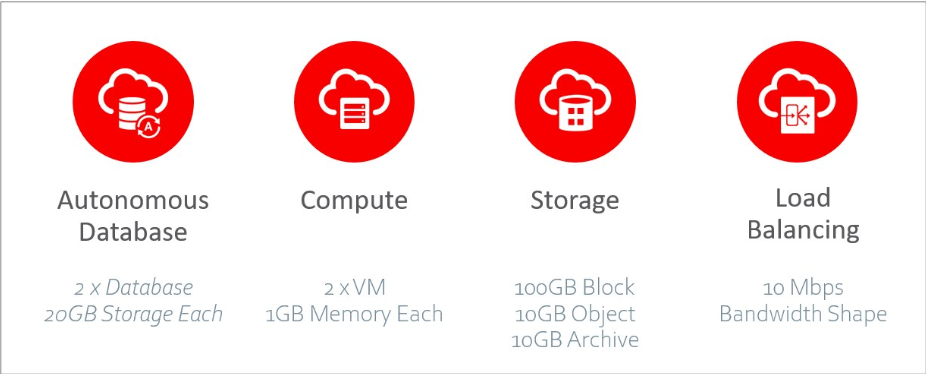
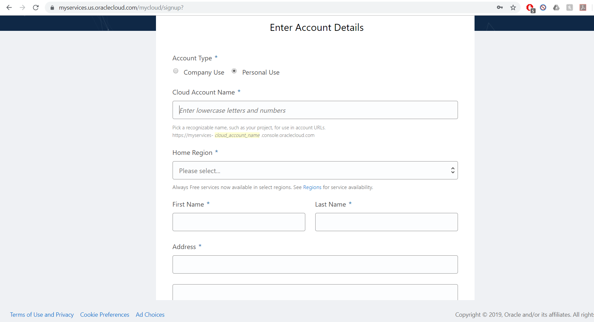
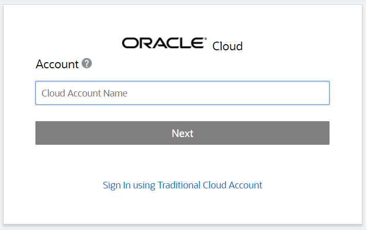
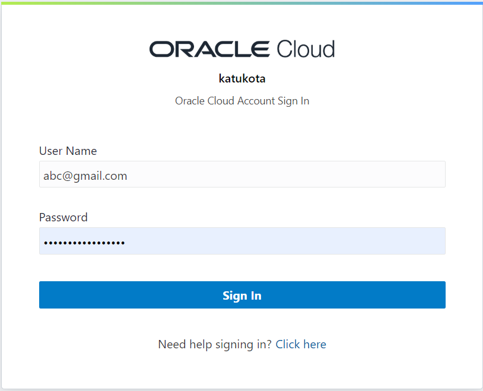

# Oracle Cloud Account

On 16th September 2019, Oracle announced a free tier. This allows students and
professionals to build, test, and deploy applications on the Oracle cloud and
database for free for an unlimited time. The free tier though, has limits for
various services. Two virtual machines and two block volumes, and 10 GB each of
object and archive storage is the current limit for free cloud tier accounts.



For cloudmesh, two services are important Oracle Cloud Compute Resources and
Oracle Storage.

## Account Creation
Please follow the steps to create a new oracle cloud account and set up the
keys and values required for the cloudmesh config file.

Step 1: Go to the Oracle Cloud website to sign up for a free account.

<https://myservices.us.oraclecloud.com/mycloud/signup?>

Step 2: Fill out your email address and click on `Next`.


Step 3: You will be directed to a page to enter your account details. Select
`Account Type` as `Personal`. Fill out all the other fields and click `Next`.



Step 4: Verify you mobile number using the code that will be messaged to you. 

Step 5: Next, you will be asked to select a password. Please select one and
click 'Next'.


Step 6: Fill out your payment information and proceed.


Oracle has now created for you a free account with $300 credit for 30 days.
After 30 days you can still use the 'Always Free' resources. Unless you
upgrade, your account will always be free.


## Account Login

To login to your account, follow the steps.

Step 1: Go to <https://www.oracle.com/cloud/sign-in.html?>. Enter the cloud
account name you used while registration and click `Next`.



Step 2: Enter the email address and password you used for registration, and
click on `Sign In`.



Now you've successfully signed in to the Oracle Cloud.

You can click on the menu on the left to explore different oracle services.
When you try to access compute or storage services, you will first need to
select a compartment. A compartment is a logical container to organize you
resources. A default compartment with the same name as your cloud name is
created. It is easiest to select that compartment.


## Oracle API

To develop or run code related to oracle, its API called OCI (Oracle Cloud
Infrastructure) needs to be installed. To do this, run the command using the
command line.

`pip install oci`

## Cloudmesh Config File

Cloudmesh config file (cloudmesh.yaml) will have the following entries for
compute and storage respectively.

### Compute Entry

```
oracle:
      cm:
        active: true
        heading: ORACLE
        host: cloud.oracle.com
        label: oracle
        kind: oracle
        version: TBD
        service: compute
      default:
        image: Oracle-Linux-7.7-2019.11.12-0
        size: VM.Standard.E2.1
        key: TBD
      credentials:
        user : TBD
        fingerprint : TBD
        key_file : ~/.oci/oci_api_key.pem
        pass_phrase : TBD
        tenancy : TBD
        compartment_id : TBD
        region : us-ashburn-1
```
        
### Storage Entry

```
oracle:
      cm:
        active: true
        heading: Oracle
        host: cloud.oracle.com
        label: oracle
        kind: oracle
        version: TBD
        service: storage
      default:
        directory: TBD
      credentials:
        user : TBD
        fingerprint : TBD
        key_file : ~/.oci/oci_api_key.pem
        pass_phrase : TBD
        tenancy : TBD
        compartment_id : TBD
        region : us-ashburn-1
```
        
## Required Keys and OCIDs

The keys marked as TBD in the config file needs to be filled in using the
values from your account. To do this, please follow the steps.

### Create API Signing Key

Run the following commands using command line.

Step 1: Create a directory `.oci` to store the credentials.

`mkdir ~/.oci`

Step 2: Generate the key using the command:

`openssl genrsa -out ~/.oci/oci_api_key.pem -aes128 -passout stdin 2048`

Step 3: You will then be prompted for a passphrase. Select a passphrase and hit
`Enter`.

Step 4: To ensure that only you can read the key, run the following command:

`chmod go-rwx ~/.oci/oci_api_key.pem`

Step 5: Now, generate the public key and hit enter. You will again be prompted
for the passphrase. Please enter the passphrase created while creating the
private key and hit `Enter`.

`openssl rsa -pubout -in ~/.oci/oci_api_key.pem -out
~/.oci/oci_api_key_public.pem -passin stdin`

Step 6: Copy the contents of the public key to the clipboard as you will
require this.

## Storage Service

## References

- Required Keys and OCIDs, <https://docs.cloud.oracle.com/iaas/Content/API/Concepts/apisigningkey.htm>
