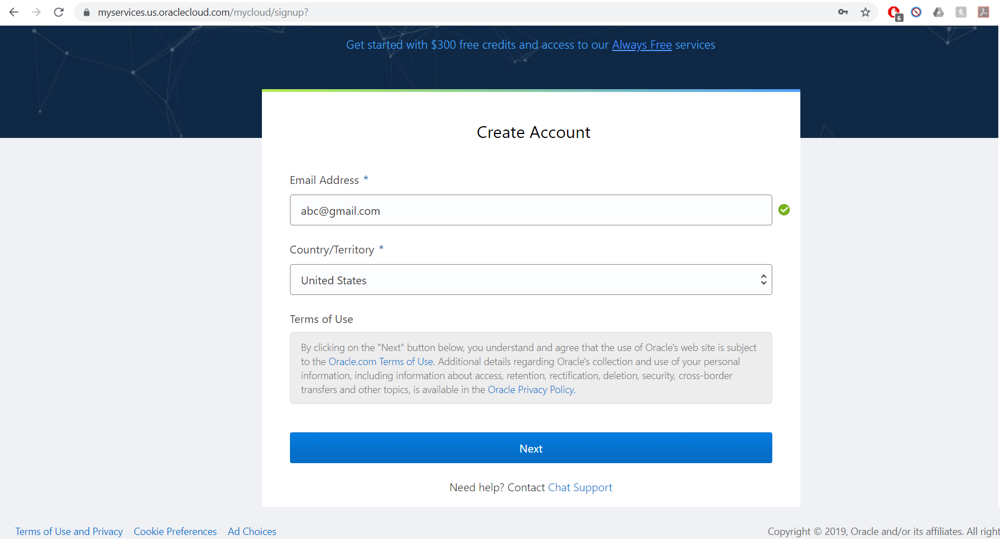
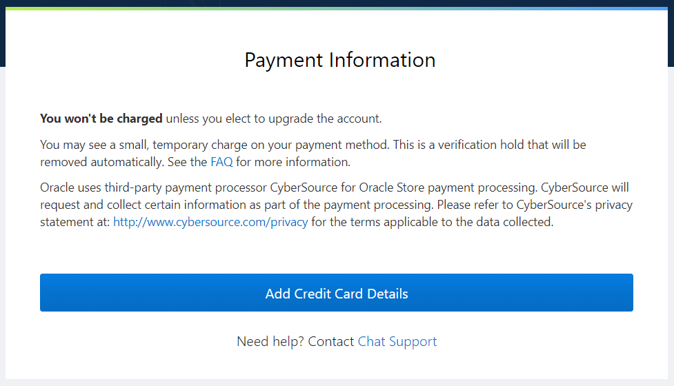
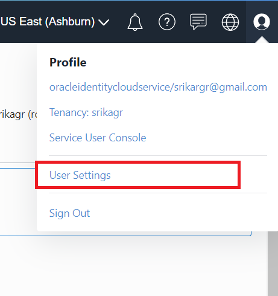
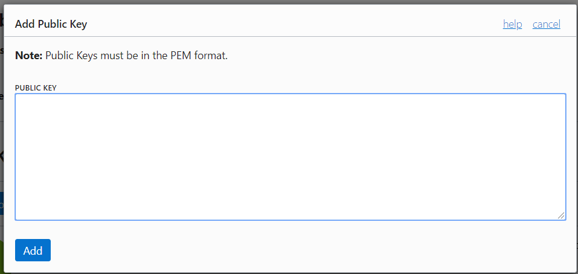
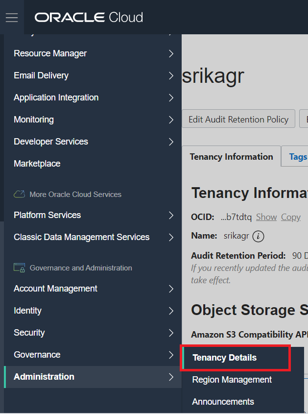
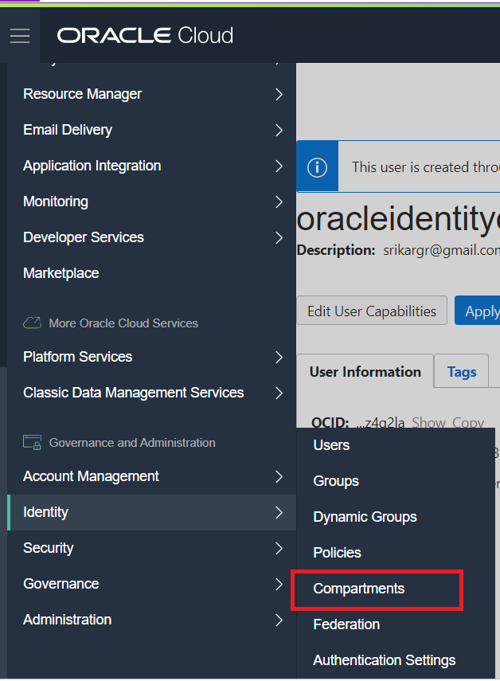

# Oracle Cloud Account

On 16th September 2019, Oracle announced a free tier. This allows students and
professionals to build, test, and deploy applications on the Oracle cloud and
database for free for an unlimited time. The free tier though, has limits for
various services. Two virtual machines and two block volumes, and 10 GB each of
object and archive storage is the current limit for free cloud tier accounts.


For cloudmesh, two services are important Oracle Cloud Compute Resources and
Oracle Storage.

## Account Creation

Please follow the steps to create a new oracle cloud account and set up the
keys and values required for the cloudmesh config file.

Step 1: Go to the Oracle Cloud website to sign up for a free account.

<https://myservices.us.oraclecloud.com/mycloud/signup?>

Step 2: Fill out your email address and click on `Next`.



Step 3: You will be directed to a page to enter your account details. Select
`Account Type` as `Personal`. Fill out all the other fields and click `Next`.


Step 4: Verify you mobile number using the code that will be messaged to you. 

Step 5: Next, you will be asked to select a password. Please select one and
click 'Next'.


Step 6: Fill out your payment information and proceed.



Oracle has now created for you a free account with $300 credit for 30 days.
After 30 days you can still use the 'Always Free' resources. Unless you
upgrade, your account will always be free.


## Account Login

To login to your account, follow the steps.

Step 1: Go to <https://www.oracle.com/cloud/sign-in.html?>. Enter the cloud
account name you used while registration and click `Next`.


Step 2: Enter the email address and password you used for registration, and
click on `Sign In`.


Now you've successfully signed in to the Oracle Cloud.

You can click on the menu on the left to explore different oracle services.
When you try to access compute or storage services, you will first need to
select a compartment. A compartment is a logical container to organize you
resources. A default compartment with the same name as your cloud name is
created. It is easiest to select that compartment.


## Oracle API

To develop or run code related to oracle, its API called OCI (Oracle Cloud
Infrastructure) needs to be installed. To do this, run the command using the
command line.

```bash
$ pip install oci
```

## Cloudmesh Config File

Cloudmesh config file (cloudmesh.yaml) will have the following entries for
compute and storage respectively. Add them to the config file if not already
there.

### Compute Entry

```
cloudmesh:
  ...
  cloud:
    oracle:
      cm:
        active: true
        heading: ORACLE
        host: cloud.oracle.com
        label: oracle
        kind: oracle
        version: TBD
        service: compute
      default:
        image: Oracle-Linux-7.7-2019.11.12-0
        size: VM.Standard.E2.1
      credentials:
        user : TBD
        fingerprint : TBD
        key_file : ~/.oci/oci_api_key.pem
        pass_phrase : TBD
        tenancy : TBD
        compartment_id : TBD
        region : us-ashburn-1
```
        
### Storage Entry

```
cloudmesh:
  ...
  storage:
    oracle:
      cm:
        active: true
        heading: Oracle
        host: cloud.oracle.com
        label: oracle
        kind: oracle
        version: TBD
        service: storage
      default:
        directory: TBD
        bucket: home
      credentials:
        user : TBD
        fingerprint : TBD
        key_file : ~/.oci/oci_api_key.pem
        pass_phrase : TBD
        tenancy : TBD
        compartment_id : TBD
        region : us-ashburn-1
```
        
## Required Keys and OCIDs

The keys marked as TBD in the config file needs to be filled in using the
values from your account. To do this, please follow the steps.

### Create API Signing Key

Run the following commands using command line.

Step 1: Create a directory `.oci` to store the credentials.

```bash
$ mkdir ~/.oci
```

Step 2: Generate the key using the command:

```bash
$ openssl genrsa -out ~/.oci/oci_api_key.pem -aes128 -passout stdin 2048
```

Step 3: You will then be prompted for a passphrase. Select a passphrase and hit
`Enter`.

Step 4: To ensure that only you can read the key, run the following command:

```bash
$ chmod go-rwx ~/.oci/oci_api_key.pem
```

Step 5: Now, generate the public key and hit enter. You will again be prompted
for the passphrase. Please enter the passphrase created while creating the
private key and hit `Enter`.

```bash
$ openssl rsa -pubout -in ~/.oci/oci_api_key.pem \
              -out ~/.oci/oci_api_key_public.pem \
              -passin stdin
```

Step 6: Copy the contents of the public key to the clipboard as you will
require this.

Step 7: Add the passphrase to your config file `cloudmesh.yaml` under oracle
section.

:o2: you should have a program that does thsi for you such as 

```
cms register oracle [--dir=~/.oci]
```

### User

The value for `user` in the config file is the OCID of your user of the
oracle cloud account. You can find this using the following steps:

Step 1: Click on the profile menu on the right and click on `User Settings`.



Step 2: The user OCID can be found under `User Information`. Copy and
paste it to the config file.
 


Step 3: Go to the end of web page and click on `Add Public Key` under `API
Keys`.
 

 
Step 4: Paste the contents of the public key `~/.oci/oci_api_key_public.pem
` to the text-box in the pop-up and click `Add`.
 


Step 5: A new key will be added to the API Keys. Copy the `Fingerprint` of
the key and paste it in the config file.

### Tenancy

The value for `tenancy` in the config file is the OCID of your tenancy account. 
You can find this using the following steps:

Step 1: Click on the navigation menu on the left, go to `Administration` and 
click on `Tenancy Details`.



Step 2: The tenancy OCID can be found under `Tenancy Information`. Copy and
paste it to the config file.
 


### Compartment

The value for `compartment` in the config file is the OCID of your
selected compartment. You can find this using the following steps:

Step 1: Click on the navigation menu on the left, go to `Identity` and 
click on `Compartments`.



Step 2: Select your root compartment from the compartment list.


Step 3: The compartment OCID can be found under `Compartment Information`. 
Copy and paste it to the config file.
 


### Public Key

Add the path to the ssh public key in the cloudmesh.yaml file in cloudmesh
/profile/publickey.

## Compute Service

The first thing we need to make sure is that a private public ssh key pair
has been set up in the default directory `~\.ssh\id_rsa.pub`. This key will
be used to login into the virtual machine instances created by us.

To set the cloud to oracle, use the command:

```bash
$ cms set cloud=oracle
```

To create a new instance on oracle cloud, use the command:

```bash
$ cms vm boot
```

To login into the instance, use the command:

```bash
$ cms vm ssh
```

To stop the instance, use the command:

```bash
$ cms vm stop 'vm-name'
```

To terminate the instance, use the command:

```bash
$ cms vm terminate 'vm-name'
```
 
## Storage Service

The first time you try to access storage services, it wil be empty and any
operation to `list/get/delete` will result in an error. Hence, to start first
`put` a new file on the cloud. This will result in creation of a new bucket
with the name specified in `cloudmesh.yaml`.

`create dir` command to create a directory on the cloud object storage
system is not supported in Oracle. Only when uploading a file can a
directory structure be created. IF all the files in the directory are
deleted, the directory is deleted too. 

To upload a new file/directory to the cloud, use the command:

```bash
$ cms storage --storage=oracle put SOURCE DESTINATION
```

To download a file from the cloud, use the command:

```bash
$ cms storage --storage=oracle get SOURCE DESTINATION
```

To list all the files from the bucket/directory, use the command:

```bash
$ cms storage --storage=oracle list SOURCE
```

To delete a file/directory from the cloud, use the command:

```bash
$ cms storage --storage=oracle delete SOURCE
```

Note that if a directory is deleted, all the files inside the directory are
also deleted.

To search a file in a particular directory, use the command:

```bash
$ cms storage --storage=oracle search DIRECTORY FILENAME
```

## References

* OCI Documentation, 
<https://oracle-cloud-infrastructure-python-sdk.readthedocs.io/en/latest
/index.html>
* Required Keys and OCIDs, 
<https://docs.cloud.oracle.com/iaas/Content/API/Concepts/apisigningkey.htm>
