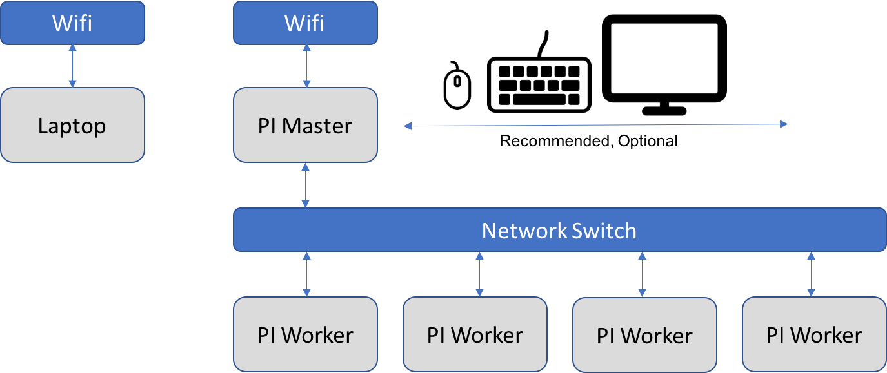

# Cloudmesh Raspberry Cloud Clusters

* This project can also be taken as independent study or as part of the Cloud
  Engineering class.
* If an online student (not living in Bloomington) like to do this project, 
  they do have to purcahse at minimum 3 Rasberry Pi's. As well as a network hub.
* Residential students will have access to 100+ Raspberry Pi's to build a cluster. 
  They can for the duration of the class obtain 10 Pi's and 2 network hubs 
  in a non-smoker environment. 
* This is an ideal project for those that like to build their own cloud cluster
* Residential students will need to focus on building a multi cluster environment.
* This project may be a preriquisite to other Pi projects.

## Goals

In this project you will be further developping and using the cloudmesh 
`cm-burn` command to create SD cards with network and host information to create 
a cluster from raspberry Pi's.

In fact residential students will build multiple such clusters. We will install 
sshd and docker on the clusters. In the project you can also experiment with 
deploying kubernetes.

You will be testing the cm burn code and improve if improvements are needed. 
You will be documenting how to create the cluster and set up the network.

You will be showcasing the cluster(s) using ssh and container applications.

## Requirements

Basic knowledge of python or a programming language as all programming is
done in python. Python is easy to learn. Access to at least 3 Raspberry Pi's. 
Minimal knowledge of networking is required, which however can be obtained 
during the project.

* This project must report on weekly basis.

## Difficulty

*easy*: For a single cluster this project is easy as mauch of the work has been 
done. However, network specifications need to be explored. 
 
*moderate*: For a multicluster environment some more work is needed and networking configurations have to be identified.

## Deliverables

* Update to the newest Raspbian
* Working command to set up the cluster. 
* Manual on how to do the setup.
* checkins into github by all team members. If only one team member checks in
  all other team members will not get credit.
* Collaborate with *all* teams that do this project so we can get benchmarks
  for all clouds and compare the results not only within your team, but all
  teams.

## Resources

* [Github](https://github.com/cloudmesh-community/cm-burn)

An image what cm burn does and how it works is available [here](https://github.com/cloudmesh-community/cm-burn/blob/master/README.md).

A single cluster is shown in the next Figure

A cluster of cluster is shown in the next figure. Residential students have 100 
Pis and many network switches to build such an environment.

